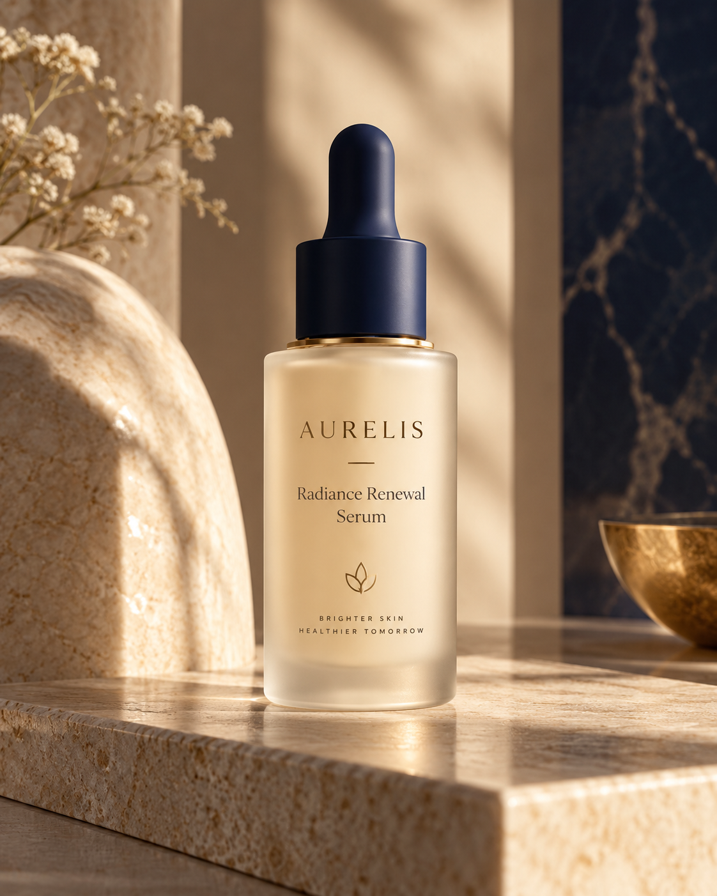

# AURELIS — Premium Skincare Launch Campaign

**Project type:** Spec project / simulated client brief  
**Brand:** AURELIS — fictional skincare brand  
**Category:** Luxury beauty / product advertising  
**Status:** Final  
**Primary tool:** ChatGPT Image

> **Disclosure:** AURELIS is a fictional brand created for portfolio practice. This project was not commissioned client work.

## Project Summary

A simulated commercial brief for a premium skincare launch. The goal was to create a cohesive three-image campaign for **AURELIS Radiance Renewal Serum** while maintaining a recognizable product identity across distinct advertising contexts.

The final set covers three complementary use cases:

1. **Hero Product Shot** — primary campaign and website hero visual
2. **Lifestyle Editorial Shot** — social and aspirational brand-context visual
3. **Macro Detail Shot** — craftsmanship, material, and premium-finish visual

## Creative Direction

The campaign uses a restrained luxury palette of warm ivory, soft beige, midnight blue, and subtle gold accents. Its visual language is polished, tactile, and editorial rather than text-heavy.

The product anchor is a frosted warm-ivory cylindrical serum bottle with a matte midnight-blue dropper cap and a thin gold ring at the neck.

## Final Deliverables

| Deliverable | Preview |
|---|---|
| Hero Product Shot | [`01-hero-product-shot.png`](assets/final/01-hero-product-shot.png) |
| Lifestyle Editorial Shot | [`02-lifestyle-editorial-shot.png`](assets/final/02-lifestyle-editorial-shot.png) |
| Macro Detail Shot | [`03-macro-detail-shot.png`](assets/final/03-macro-detail-shot.png) |

## Role / Skills Demonstrated

- Translating a creative brief into a clear visual direction
- Prompt design and iterative refinement
- Maintaining a recognizable product identity across multiple images
- Luxury product art direction
- Commercial composition and lighting direction
- Comparing, rejecting, and selecting outputs against the brief
- Building a cohesive campaign rather than a set of isolated generations

## Process

The campaign was developed in three stages:

**Hero → Lifestyle → Macro Detail**

The strongest hero frame was selected as the visual anchor. Subsequent prompts explicitly preserved the established bottle silhouette, material palette, cap color, and gold neck ring.

An initial close-up attempt was rejected because it still read as a tighter version of the hero shot. The macro prompt was then revised to emphasize material craftsmanship, texture, and close-cropped editorial framing.

See [`03-process-and-selection.md`](03-process-and-selection.md) for the full selection rationale.

## Project Files

- [`01-client-brief.md`](01-client-brief.md) — simulated client brief and campaign requirements
- [`02-production-prompts.md`](02-production-prompts.md) — final production prompts
- [`03-process-and-selection.md`](03-process-and-selection.md) — selection logic, rejected direction, and lessons
- [`assets/final/`](assets/final/) — final campaign images
- [`assets/alternates/`](assets/alternates/) — alternate / rejected generations retained for process documentation

## Portfolio Caption

**AURELIS — Premium Skincare Launch Campaign**  
A speculative client project created to demonstrate AI-assisted luxury product advertising. The goal was to develop a cohesive three-image campaign for a fictional skincare serum brand, comprising a hero launch visual, an editorial lifestyle image, and a macro beauty detail shot. The project focused on recognizable product consistency, premium art direction, iterative refinement, and commercially polished visual execution.
