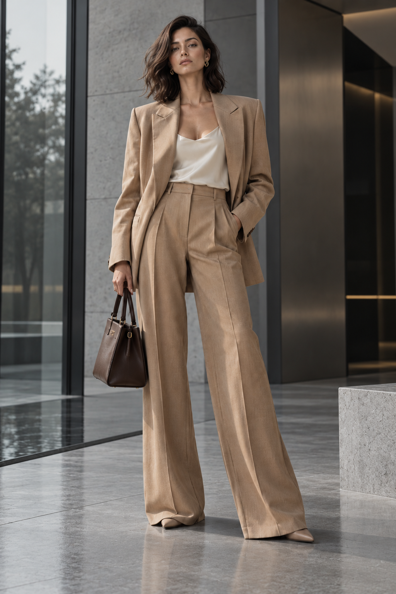

# SOLVANE — Quiet Movement

**Project type:** Spec project / simulated client brief  
**Brand:** SOLVANE — fictional contemporary womenswear label  
**Category:** Fashion / editorial  
**Status:** Final  
**Primary tool:** ChatGPT Image

> **Disclosure:** SOLVANE is a fictional brand created for portfolio demonstration. This project was not commissioned client work.

## Project Summary

A simulated luxury fashion campaign exploring AI-assisted editorial image creation across three coordinated compositions. The project focused on recognizable model continuity, wardrobe consistency, believable tailoring, material fidelity, and a controlled cool architectural visual language.

The final set covers three complementary editorial roles:

1. **Editorial Hero** — full-body campaign anchor in a cool contemporary architectural setting
2. **Urban Movement** — walking editorial image with natural garment motion and metropolitan context
3. **Tailoring Detail** — close-cropped material and craftsmanship study

## Creative Direction

SOLVANE uses a restrained **quiet-luxury** visual language built around cool architectural materials—slate grey, concrete, charcoal, smoked glass, and dark metal—contrasted by warm camel-beige tailoring, ivory silk, espresso leather, and subtle gold jewelry.

The campaign was intentionally designed to contrast with the warmer beauty/product world of Project #1 (AURELIS).

## Final Deliverables

| Deliverable | Preview |
|---|---|
| Editorial Hero | [`01-editorial-hero-anchor.png`](assets/final/01-editorial-hero-anchor.png) |
| Urban Movement | [`02-urban-movement.png`](assets/final/02-urban-movement.png) |
| Tailoring Detail | [`03-tailoring-detail.png`](assets/final/03-tailoring-detail.png) |

## Role / Skills Demonstrated

- Translating a fashion brief into a distinct visual system
- AI image generation and prompt iteration
- Maintaining recognizable model and wardrobe continuity
- Fashion editorial composition
- Human anatomy and hand QA
- Tailoring, fabric, and material evaluation
- Art-direction separation between portfolio projects
- Comparing, rejecting, and selecting outputs against the brief
- Changing camera language across a coordinated campaign

## Process

The campaign evolved through four decisions:

**Warm direction rejected → Cool hero anchor → Urban movement → Tailoring detail**

The first hero image was visually strong but rejected because its warm stone environment overlapped too closely with AURELIS. The art direction was then rebuilt around a cooler architectural palette, and that revised hero became the visual anchor for the remaining images.

Two Urban Movement generations came out nearly identical, which highlighted an important production lesson: when genuine alternatives are required, camera position or movement direction should be changed intentionally rather than relying on repeated generations of an unchanged prompt.

The final image changed the camera language entirely, using a close crop to focus on lapel construction, silk, leather, hand gesture, and fabric texture.

See [`03-process-and-selection.md`](03-process-and-selection.md) for the full selection rationale.

## Project Files

- [`01-client-brief.md`](01-client-brief.md) — simulated client brief and campaign requirements
- [`02-production-prompts.md`](02-production-prompts.md) — final production prompts
- [`03-process-and-selection.md`](03-process-and-selection.md) — selection logic, rejected direction, and lessons
- [`assets/final/`](assets/final/) — final campaign images
- [`assets/alternates/`](assets/alternates/) — alternate / rejected generations retained for process documentation

## Portfolio Caption

**SOLVANE — Quiet Movement / Autumn Editorial Campaign**  
A speculative client project for a fictional contemporary luxury fashion label. The campaign demonstrates AI-assisted editorial image creation across a hero portrait, an urban movement image, and a tailoring detail study. The project focused on recognizable model and wardrobe continuity, realistic human rendering, material fidelity, deliberate art-direction choices, and visual cohesion within a cool contemporary architectural world.
