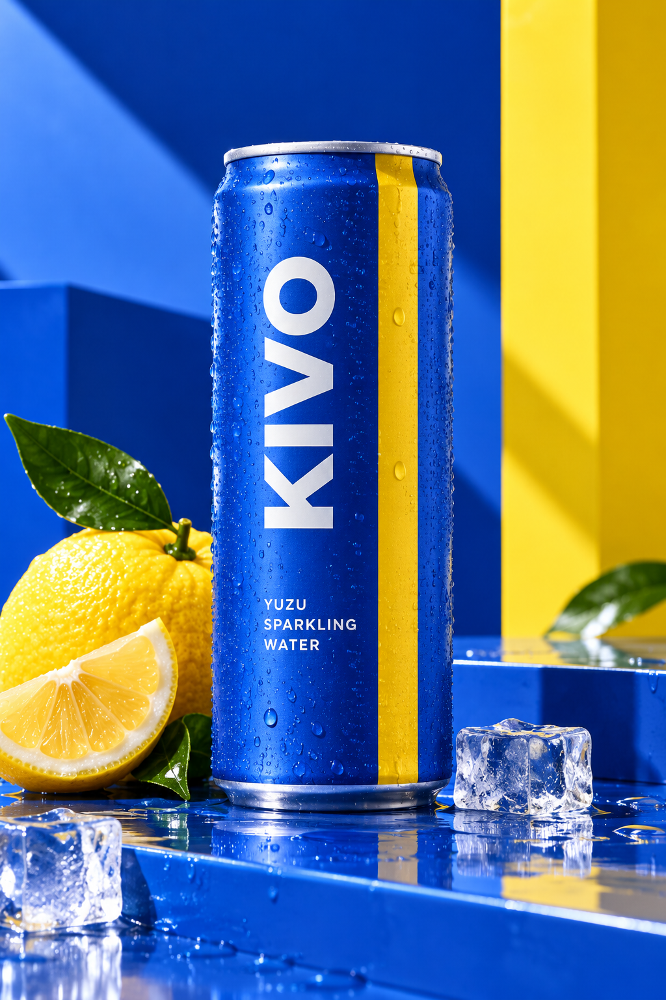

# KIVO — BRIGHT HIT

**Spec / Simulated Client Project — AI-Assisted Beverage Advertising Campaign**



## Project Summary

KIVO is a fictional sparkling-water brand created for portfolio practice. **BRIGHT HIT** is a three-image campaign for **KIVO Yuzu Sparkling Water**, developed to demonstrate AI-assisted commercial visual creation through beverage art direction, recognizable packaging continuity, iterative refinement, visual QA, asset selection, and campaign thinking.

Rather than treating the final images as isolated generations, the project uses them as a coordinated launch system with three distinct commercial roles:

- **Hero Packshot** — introduces the packaging and establishes the campaign identity
- **Dynamic Splash** — adds motion, cold-refreshment cues, and visual impact
- **Lifestyle Hand Shot** — places the product in a human, social, product-in-use context

Together, the three assets maintain a recognizable KIVO visual identity while adapting the product to different advertising applications.

## Campaign

**BRIGHT HIT**

The campaign is built around a bold cobalt-blue and citrus-yellow visual system, chilled-product cues, sharp commercial lighting, and restrained citrus styling. The direction is intentionally energetic and graphic, distinguishing KIVO from the warmer luxury-beauty direction of AURELIS and the cooler architectural-fashion direction of SOLVANE.

## Final Deliverables

| Asset | Campaign Role |
| --- | --- |
| [Hero Packshot](assets/final/01-hero-packshot-anchor.png) | Brand and packaging introduction |
| [Dynamic Splash](assets/final/02-dynamic-splash.png) | Attention, motion, and refreshment |
| [Lifestyle Hand Shot](assets/final/03-lifestyle-hand-shot.png) | Product-in-use, social, and lifestyle context |

## Visual Direction

- Saturated cobalt blue
- Citrus yellow
- Crisp white
- Cool metallic silver
- Fresh green accents
- Condensation, ice, water, and citrus cues
- Sharp, energetic commercial lighting
- Bold graphic compositions with clear product hierarchy

## Campaign System

The campaign progresses from product clarity to visual energy to human context:

```text
Hero Packshot
  ↓
Establish packaging + campaign identity

Dynamic Splash
  ↓
Introduce motion + refreshment + visual impact

Lifestyle Hand Shot
  ↓
Add product-in-use + social context
```

This structure allows the same recognizable product identity to support multiple marketing functions without relying on three variations of the same composition.

## Project Files

- [`01-client-brief.md`](01-client-brief.md)
- [`02-production-prompts.md`](02-production-prompts.md)
- [`03-process-and-selection.md`](03-process-and-selection.md)
- [`04-marketing-campaign.md`](04-marketing-campaign.md)

## Skills Demonstrated

- AI-assisted commercial image creation
- Beverage product art direction
- Campaign visual-system development
- Packaging continuity across multiple scenes
- Product styling and chilled-product cues
- Motion and splash composition
- Human-product interaction
- Prompt development and iterative refinement
- Visual QA, rejection, and asset selection
- Asset-role planning across marketing contexts
- Translating a visual brief into a coordinated campaign system

## Tool

- ChatGPT Image

## Disclosure

KIVO is a fictional brand created for portfolio demonstration. This is a spec / simulated client project and was not commissioned or paid client work. The project does not represent a real commercial campaign, media placement, client approval, or measured campaign performance.
