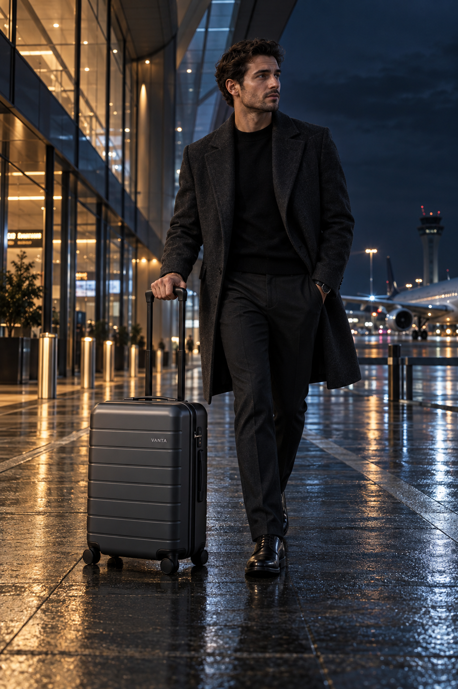

# VANTA — AFTER HOURS

**Spec / Simulated Client Project — AI-Assisted Cinematic Travel Campaign**

## Project Summary

VANTA is a fictional premium luggage brand created for portfolio demonstration. **AFTER HOURS** is a three-image cinematic travel campaign built around one traveler, one **VANTA Carry-On 01**, and one nocturnal journey.

The project demonstrates AI-assisted commercial storytelling through narrative sequencing, recognizable traveler and luggage continuity, product integration, cinematic lighting, deliberate camera-language changes, iterative refinement, visual QA, asset selection, and campaign-level thinking.

Rather than treating the final images as isolated luggage visuals, the campaign follows a simple progression:

**Departure → In Transit → Arrival**

Each image advances the same journey while serving a different narrative and commercial purpose.

## Campaign Structure

1. **Departure / Hero** — introduces the traveler, product, nighttime world, and campaign mood.
2. **In Transit / Motion** — shifts the camera language into active lateral movement and advances the journey.
3. **Arrival / Detail Narrative** — resolves the sequence through a quieter, closer human-product interaction.

## Narrative Camera Language

The three final frames deliberately change perspective as the journey progresses:

**Frontal hero → lateral motion → intimate arrival detail**

This progression helps the campaign move beyond simple scene variation. The camera language changes with the narrative function of each asset while the traveler, luggage, wardrobe, palette, and nighttime environment remain recognizably connected.

## Visual Direction

- Deep navy
- Petrol blue
- Charcoal
- Cool steel
- Wet asphalt grey
- Restrained amber practical lights
- Glass architecture
- Reflective floors / pavement
- Cinematic nighttime atmosphere
- Cool ambient light balanced with warm practical sources

The visual world is designed to feel metropolitan, quiet, controlled, and cinematic rather than bright, fashion-led, or heavily stylized.

## Final Deliverables

| Asset | Campaign Role |
| --- | --- |
| [Departure Hero](assets/final/01-departure-hero-anchor.png) | Introduce traveler, product, nighttime world, and mood |
| [In Transit Motion](assets/final/02-in-transit-motion.png) | Advance the journey through movement and active product use |
| [Arrival Detail Narrative](assets/final/03-arrival-detail-narrative.png) | Resolve the journey through closer human-product interaction |

## Iterative Refinement

A first In Transit attempt was rejected despite being visually strong:

`assets/alternates/rejected-in-transit-too-similar.png`

Its camera angle, traveler orientation, suitcase placement, and overall composition remained too close to the Departure Hero. The image worked aesthetically, but it did not advance the narrative enough to justify its role as the campaign's second chapter.

The prompt was revised to require a clear lateral perspective, left-to-right travel direction, a wider environmental composition, and the suitcase trailing behind the traveler.

That correction produced the selected In Transit frame:

`assets/final/02-in-transit-motion.png`

This iteration captures an important part of the project's creative process: a visually attractive image can still fail the brief if it does not perform its intended narrative function.

## Skills Demonstrated

- AI-assisted cinematic image creation
- Commercial travel art direction
- Narrative campaign sequencing
- Recognizable traveler continuity
- Recognizable luggage continuity
- Product integration within environmental storytelling
- Camera-language control
- Cinematic lighting direction
- Human-product interaction
- Prompt development and iterative refinement
- Visual QA and rejection decisions
- Asset selection
- Campaign-role planning
- Proposed marketing application

## Project Files

- [`01-client-brief.md`](01-client-brief.md)
- [`02-production-prompts.md`](02-production-prompts.md)
- [`03-process-and-selection.md`](03-process-and-selection.md)
- [`04-marketing-campaign.md`](04-marketing-campaign.md)

## Tool

- ChatGPT Image

## Disclosure

VANTA is a fictional brand created for portfolio demonstration. **AFTER HOURS** is a spec / simulated client project and was not commissioned or paid client work.

The project does not represent real client approval, media placement, retail activity, customer response, or measured commercial performance.

---
